<h1 align="center"><b>Docsify setup document </u></b></h1>

## **Table of Contents** 

[Overview](#overview)

[Setup docsify in podman container](#setup-docsify-in-podman-container)

[Login github](#login-github)

[Markdown basic syntax](#3-markdown-basic-syntax)

## **Overview** 

 >podman is a containerization tool for Linux-based operating systems. You can follow these steps to install Podman on Ubuntu:

**system updates**:

- First, update your system so that you have the latest package progress and dependencies:

>sudo apt update

## Install Podman 

- Now install the podman package

>sudo apt install -y podman

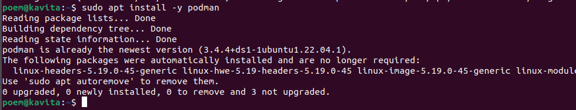

- By doing this flag you will not need to avoid any confirmation in the installation process.

## Podman  Version Check

- podman is installed, you can check its version using the podman --version command:

>podman --version

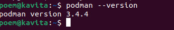

- If Padman is successfully installed in your system, then it will show you the version number.

## 2. Setup docsify in podman container

- To set up Docsify in Podman container you need to follow below steps:

**Create a Directory for Docsify**

- Create a directory where you'll keep your Docsify documentation files. For example
>mkdir docs
>cd docs

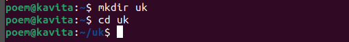

## Create the File and Open it for Editing:

>touch index.html
>touch README.md

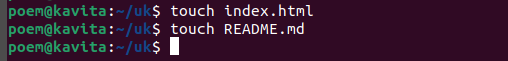

- You can use a text editor like vim to create and edit the file. Open your terminal and run:

* Then after that we have to write the code of html in Index.html

 >vim index.html

***Create a file named "index.html" in your preferred text editor and paste the following content***

 >vim README.md

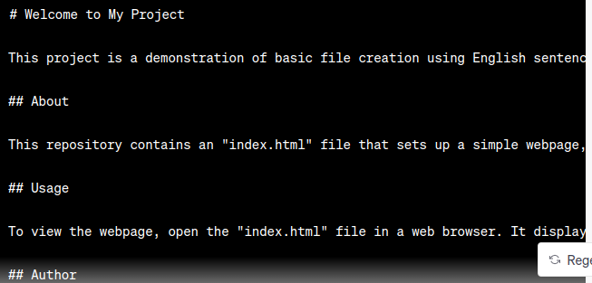
 

***Create a file named "Readme.md" in your preferred text editor and paste the following content***

## Create Dockerfile 

> 

## Run the New Container and Set the Directory

- Run the new container and enter the desired directory where you want to work with Docsify. Replace **/path/to/your/directory** with the actual path to your desired directory:

- First, create a Podman container for Docsify.

>Podman run -d -p 3000:3000 -v /home/poem/docs:/docs localhost/docsify/demo

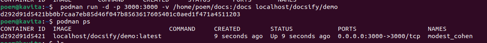

- Check if the container is created with the “podman ps” command.

>Podman ps

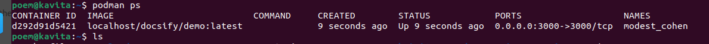

## Access your Docsify documentation

- Open your web browser and enter http://localhost:3000 in the address bar. This will allow you to view your Docsify documentation served from the container. You should see the Docsify interface displaying your documentation content.

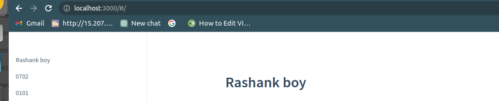

## 3.  Login github 

**Now go to GitHub but how to login to GitHub account is given below**

***Here's a step-by-step guide to hosting Docsify docs on GitHub***

## Step 1: Create GitHub Repository

>Log in to your GitHub account.

## Create a New Repository

***On GitHub, click the "New" button to create a new repository. Give it a name of your choice***

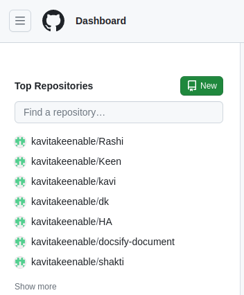

## Step 2: Fill Repository Details

- Choose a name for your repository, like "my-docs."

- Write a short description about your project or documentation.

- Choose whether the repository should be public or private.

- Check the "Initialise this repository with a README" option

## Step 3 : Stage and Commit Changes

>***git add*** to stage changes, ***commit*** them with git commit, and push them to the remote repository with git push. Has this process enabled you to integrate your Doxify documentation into a GitHub repository and manage it under centralised version control

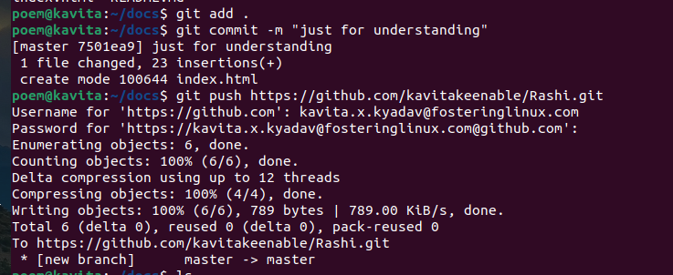

## Step 4 : Clone the Repository

***Choose the "Clone" option on GitHub to get the repository URL. Copy this URL***

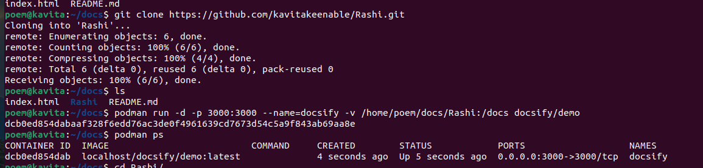

## Step 5 Integration docsify and gitHub

To integrate Docsify with GitHub and ensure seamless integration, include the repository name in the URL path. 

>Podman run -d -p 3000:3000  --name=docsify -v /home/poem/Rashi:/docs 
docsify/demo

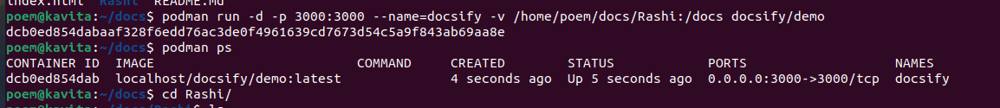

## Step 6 Access Account Settings

> ***Navigate to your account settings. Look for your profile picture or username at the top-right corner and click on it to access your account settings.***
>- Within the account settings, search for a section related to "Tokens," "Security," or ***"Developer Settings."***

|   **profile account**       | **Setting**          | 
|---|--|
| 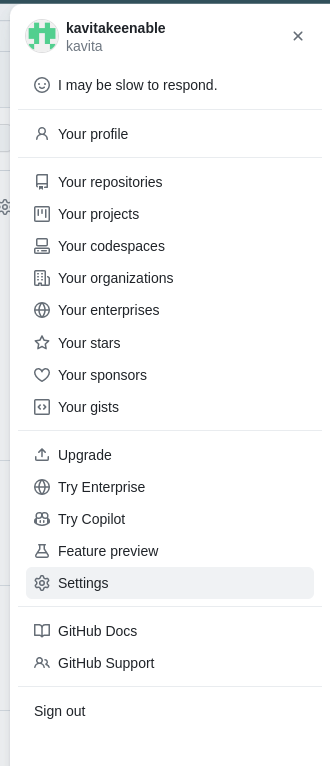 |        |

## Create New Token

>- Choose the option to create a new personal access token.

>- Click the button to generate the token.

|  ***Personal Access tokens*** | ***Generate New token***| ***Note***|
|---|----|----|
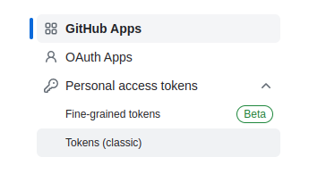 |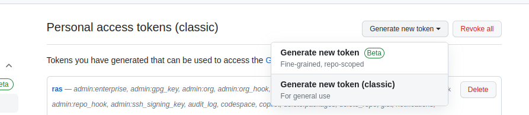 |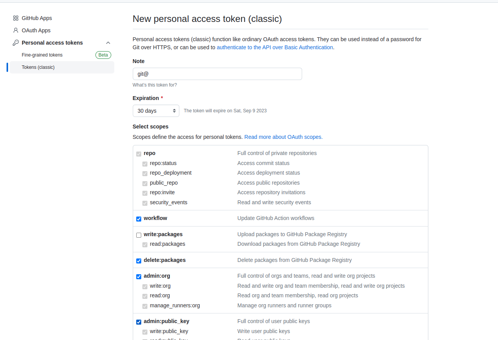 |

>- Once generated, you'll typically see the token displayed on your screen.
Copy and Store Securely

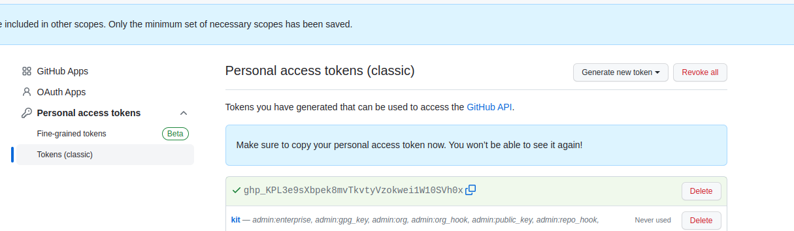

>- Copy the token to your clipboard.
Store the token in a safe place, like a password manager or a secure document.

***Similarly you can push when you have to update any code you will push and when you have to take any code from remote server then you will pull***

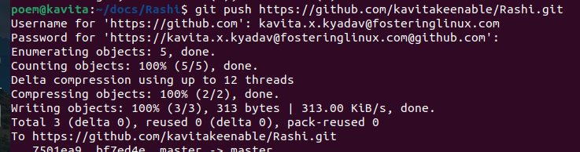

# 3.Markdown Basic Syntax

## Overview

> Markdown is a plain text formatting language used to create simple and structured documents. It is commonly used for web content, readme files, documentation, email, and various other types of text-based content. Below I'm doing some common Markdown syntax examples and their explanations:

## 1. Headings
> Headings are created using the # symbol, with one # indicating Heading 1 and six # indicating Heading 6.

**output**

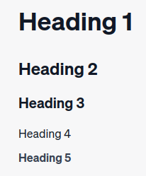

## 2. Text Formatting

>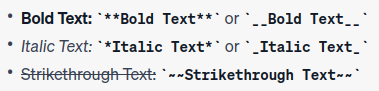

**Output**
>Bold Text: **Bold Text** or __Bold Text__
Italic Text: *Italic Text* or _Italic Text_
Strikethrough Text: ~~Strikethrough Text~~

## 3. Blockquota 

 To create a blockquote in Markdown, you use the > symbol. Place the > symbol before the text you want to include in the blockquote.

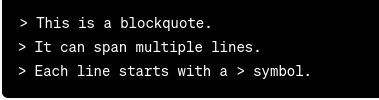 

havita kavita

**Output**

