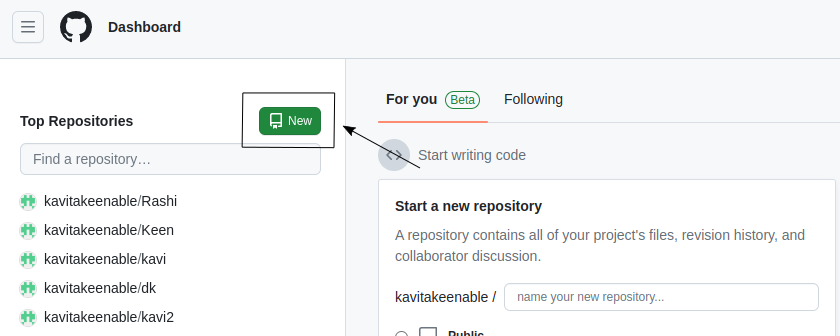
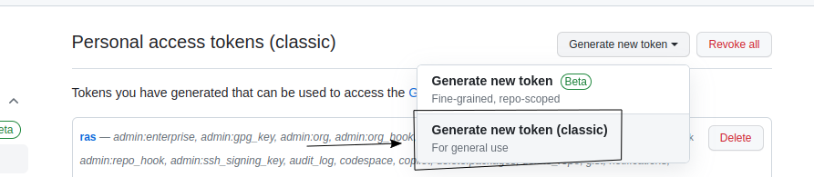

<h1 align="center"><b>Docsify setup document </u></b></h1>

# Table of Contents

[Overview](#overview)

[Setup docsify in podman container](#2-setup-docsify-in-podman-container)

[Login github](#login-github)

[Markdown basic syntax](#Markdown-basic-syntax)

## **Overview** 

 >podman is a containerization tool for Linux-based operating systems. You can follow these steps to install Podman on Ubuntu:

**system updates**:

- First, update your system so that you have the latest package progress and dependencies:

> sudo apt update
 

## Install Podman 

- Now install the podman package

>  sudo apt install -y podman 

- By doing this flag ***"(-y)"*** you will not need to avoid any confirmation in the installation process.

##  Check Podman Version 

- podman is installed, you can check its version using the podman --version command:

>podman --version

- If Padman is successfully installed in your system, then it will show you the version number.

## 2. Setup docsify in podman container

- To set up Docsify in Podman container you need to follow below steps:

**Create a Directory for Docsify**

- Create a directory where you'll keep your Docsify documentation files. For example

> - You can create a new folder. then  you can use the "mkdir folder_name" command in Terminal to create a new folder.

>- mkdir uk

> - Navigate Inside the Folder
>cd uk

## Create the File and Open it for Editing:

>touch index.html

>touch README.md

- You can use a text editor like vim to create and edit the file. Open your terminal and run:

* Then after that we have to write the code of html in Index.html

 >vim index.html

***Create a file named "index.html" in your preferred text editor and paste the following content***

 >vim README.md

 

***Create a file named "Readme.md" in your preferred text editor and paste the following content***

## Create Dockerfile 

> FROM node:latest

> LABEL description="A demo Dockerfile for build Docsify."

> WORKDIR /docs
 
> RUN npm install -g docsify-cli@latest
 
> EXPOSE 3000/tcp
 
> ENTRYPOINT docsify serve .

## Build docker image

 > docker build -f Dockerfile -t docsify/demo .

## Run the New Container and Set the Directory

- Run the new container and enter the desired directory where you want to work with Docsify. Replace **/path/to/your/directory** with the actual path to your desired directory:

> ***let me explain the options -d, -p, and -v that are used in Podman containers***

> - **"-d"** **(Detach Mode)** : This option allows the container to run in the background, meaning the container will run as a separate process and free up your terminal. It's useful for users who don't want to see the container's output in the terminal.

> - **"-p"** **(Port Forwarding)** : This option enables port forwarding between the container and the host system. This means you can access the services running inside the container without external categorization.

> - **"-v"** **(Volume Mount)** : This option allows you to mount a file or directory between the container and the host system. As a result, you can use your host file system within the container, enabling data sharing for your container.

- ***First, create a Podman container for Docsify.***

>Podman run -d -p 3000:3000 -v /home/poem/docs:/docs localhost/docsify/demo

- Check if the container is created with the **“podman ps”** command.

>Podman ps

## Access your Docsify documentation

- Open your web browser and enter **http://localhost:3000** in the address bar. This will allow you to view your Docsify documentation served from the container. You should see the Docsify interface displaying your documentation content.

- #### Docsify use the reference link for additional information
     https://docsify.js.org/#/

# 3.  started with GitHub
## Step 1.  

## Login github

**Now go to GitHub but how to login to GitHub account is given below**

* **Here's a step-by-step guide to hosting Docsify docs on GitHub**

***Login ya Sign in Github Account***

>Log in to your GitHub account.

## Create a New Repository

***On GitHub, click the "New" button to create a new repository. Give it a name of your choice***

## Step 2: Fill Repository Details

> 1. In the **"Repository name"** box, type **"DK12"**

> 2. In the **"Description"** box, type a short description.

> 3. Select whether your repository will be **"Public or Private"**

> 4. Select Add a README file.

> 4. Click **"Create repository"**

## Step 3 : Stage and Commit Changes

***use of the Git commands - commit, clone, push, and pull***

> ***git add*** to stage changes, ***commit*** them with git commit, and push them to the remote repository with git push. Has this process enabled you to integrate your Doxify documentation into a GitHub repository and manage it under centralised version control

> - **Commit** : The git commit command is used to permanently store the changes made to code. Whenever you make changes to your code that you want to keep, you create a "commit" that contains a brief description of the changes you made. This helps in keeping track of the project's history.

> - **Push** : The git push command is used to upload the committed changes from your local computer to a remote Git repository. When you make changes to your code and commit them, you need to push those changes to your remote repository so that others can see and access them.

## Step 4 : Clone the Repository

***Choose the "Clone" option on GitHub to get the repository URL. Copy this URL***

> - **Clone**: The git clone command is used to copy the entire remote Git repository onto your local machine. It's a way to get a complete copy of all files and history from the remote repository onto your system. This is often used when you want to start working on a project that is hosted remotely.

## Step 5 Integration docsify and gitHub

- To integrate Docsify with GitHub and ensure seamless integration, include the repository name in the URL path. 

>Podman run -d -p 3000:3000  --name=docsify -v /home/poem/Rashi:/docs 
docsify/demo

## Step 6 Access Account Settings

> ***Navigate to your account settings. Look for your profile picture or username at the top-right corner and click on it to access your account settings.***
>- Within the account settings, search for a section related to "Tokens," "Security," or ***"Developer Settings."***

|   **profile account**       | **Setting**          | 
|---|----|
|    | |

## Create New Token

>- Choose the option to create a new personal access token.

>- Click the button to generate the token.

  ### Personal Access tokens

 ### Generate New token

 
### Set Permissions

> Specify what the token can do. Choose permissions like accessing repositories or performing read/write actions.

>- Once generated, you'll typically see the token displayed on your screen.
Copy and Store Securely.

>- Copy the token to your clipboard.
Store the token in a safe place, like a password manager or a secure document.

***Similarly you can push when you have to update any code you will push and when you have to take any code from remote server then you will pull***

- #### GitHub use the reference link for additional information
    https://docs.github.com/en/get-started/quickstart/hello-world

# 3.Markdown Basic Syntax

## Overview

> Markdown is a plain text formatting language used to create simple and structured documents. It is commonly used for web content, readme files, documentation, email, and various other types of text-based content. Below I'm doing some common Markdown syntax examples and their explanations:

## 1. Headings
> Headings are created using the # symbol, with one # indicating Heading 1 and six # indicating Heading 6.

**output**

## 2. Text Formatting

>

**Output**
>Bold Text: **Bold Text** or __Bold Text__
Italic Text: *Italic Text* or _Italic Text_
Strikethrough Text: ~~Strikethrough Text~~

## 3. Blockquota 

 To create a blockquote in Markdown, you use the > symbol. Place the > symbol before the text you want to include in the blockquote.

 

**Output**

- #### Markdown Use the reference link for additional information 
     https://www.markdownguide.org/cheat-sheet/
